# Editian

<p align="center">
  
</p>

<p align="center">
  Edit Word and PowerPoint files with AI, review every change, and keep full control.
</p>

Editian is a browser-based editor for `.docx`, `.pptx`, and markdown files. Upload a document, describe what you want in plain language, review the before/after diff, and accept only the changes you want.

## License

Editian is distributed under the `PolyForm Noncommercial 1.0.0` license.

- Noncommercial use, modification, and redistribution are allowed under that license.
- Commercial use is not allowed without separate permission from the copyright holder.

See [LICENSE](LICENSE) for the full license text.
See [COMMERCIAL.md](COMMERCIAL.md) for commercial licensing inquiries.

## Why Use It?

- Works with **Word, PowerPoint, and Markdown files**
- Lets you **edit with natural-language instructions**
- Shows a **diff before anything is applied**
- Supports **local models with Ollama** or **hosted APIs like OpenAI**
- Keeps the workflow **non-destructive** until you click **Accept**
- **Compares two documents** side-by-side with AI-powered entity diff
- **Extracts a knowledge graph** from any document and uses it to ground AI chat answers

## What You Can Do

### DOCX

- Revise a whole document or selected paragraphs
- Paraphrase, shorten, formalize, or clean up wording
- Insert new paragraphs
- Delete paragraphs
- Summarize a selected section and place the summary below it
- Merge multiple selected paragraphs into one
- Edit tables

### Markdown

- Review rendered markdown while editing the underlying `.md` source by block
- Revise a whole file or selected blocks with AI
- Manually edit markdown blocks and keep undo/redo support

### PPTX

- Revise slide text or selected text boxes
- Edit PPTX tables
- Add slides
- Preview slides with a higher-fidelity renderer when LibreOffice + Poppler are installed

## Modes

### AI Mode

The main editing mode. Upload a document and use three tabs in the sidebar:

- **Edit** — give natural-language instructions, review the diff, accept or reject each change
- **Chat** — ask questions about the document; optionally enable the knowledge graph for more accurate, entity-grounded answers
- **Graph** — extract a knowledge graph from the document and explore entities and relationships visually

### Manual Mode

Click any paragraph, shape, or table cell to edit it directly inline. Undo/redo is fully supported.

### Compare Mode

Load two documents (from your workspaces or as new uploads) and compare them side-by-side. Three views are available:

- **Documents** — scroll both documents in sync
- **Entity Diff** — extract entities from both documents with AI and see a structured table of what changed, was added, or was removed
- **Graph** — view both entity graphs overlaid, with color-coded diff status on each node

The compare chat uses both document texts and the entity diff as context, so it can answer questions like "what changed in section 3?" with entity-level precision.

## Knowledge Graph

Editian can extract a knowledge graph from any document using your configured LLM. The graph captures:

- **Entities** — people, organizations, dates, numbers, locations, products, and concepts, each with a value and the paragraph numbers where they appear
- **Relationships** — directed connections between entities (e.g. `Acme Corp → employs → John Smith`)

Once extracted, the graph is shown as an interactive force-directed canvas (Obsidian-style). You can zoom, pan, drag nodes, and export the graph as a PNG.

### Using the Graph in AI Chat

After extracting the graph, go to the Chat tab. An indigo **Knowledge graph active** indicator appears above the input bar. When active, every chat message sends the full entity and relationship list to the LLM as structured context — in addition to the document text.

This helps the LLM:
- Answer entity-specific questions without scanning the full document
- Cite paragraph numbers accurately
- Reason about relationships between named entities

You can toggle the graph context on or off at any time without re-extracting.

## Workspaces

The left panel shows your workspaces — one per document. You can:

- Create, rename, and delete workspaces
- Organize workspaces into directories
- Branch a workspace to create an independent copy
- Drag workspaces between directories

Background tasks (graph extraction, entity diff) run independently of which workspace is active. A pulsing indicator in the top bar shows when any task is still processing. Each workspace row shows a spinner while its graph is being extracted, even if you have switched away.

## Quick Start

### Docker

If you want the easiest install path, use Docker Compose. The setup runs separate frontend and backend containers:

- `frontend`: nginx serving the built React app
- `backend`: FastAPI + LibreOffice + Poppler for document editing and PPTX rendering

To change the host ports, create a root `.env` file (next to `compose.yml`) like this:

```bash
EDITIAN_FRONTEND_PORT=3000
EDITIAN_BACKEND_PORT=8000
EDITIAN_LOG_LEVEL=INFO
EDITIAN_LOG_FORMAT=text
EDITIAN_LOG_TO_FILE=true
EDITIAN_LOG_DIR=/root/.editian/logs
EDITIAN_LOG_FILE_NAME=backend.log
EDITIAN_LOG_ROTATION_WHEN=midnight
EDITIAN_LOG_ROTATION_INTERVAL=1
EDITIAN_LOG_BACKUP_COUNT=14
EDITIAN_LOG_ROTATION_UTC=false
```

```bash
docker compose up --build
```

Then open:

```text
http://localhost:3000
```

Notes:

- Uploaded files and undo/redo history are stored in the `editian_data` Docker volume
- The container includes LibreOffice and Poppler, so PPTX rendering uses the higher-fidelity slide image path
- If you want S3-backed storage, add the relevant environment variables in `compose.yml`
- LLM provider settings are still configured inside the app UI
- If you use Ollama on your host machine while Editian runs in Docker, set the app's Ollama Base URL to `http://host.docker.internal:11434/v1`
- The LLM settings panel includes a `Test connection` button so you can verify the provider/model before using chat or revise
- If `EDITIAN_FRONTEND_PORT` is not set, Docker Compose uses `3000`
- If `EDITIAN_BACKEND_PORT` is not set, Docker Compose uses `8000`
- The browser should use the frontend port; nginx proxies `/api` to the backend container automatically
- If you set `EDITIAN_FRONTEND_PORT=8080`, open `http://localhost:8080` instead
- Set `EDITIAN_LOG_FORMAT=json` if you want structured container logs
- Backend logs are also written to `/root/.editian/logs/backend.log` inside the backend container by default

To stop the app:

```bash
docker compose down
```

To also remove the persisted document volume:

```bash
docker compose down -v
```

### 1. Start the backend

Using `uv`:

```bash
cd backend
uv venv
uv pip install -r requirements.txt
source .venv/bin/activate   # Windows: .venv\Scripts\activate
uvicorn main:app --reload
```

Or with `pip`:

```bash
cd backend
python -m venv .venv
source .venv/bin/activate
pip install -r requirements.txt
uvicorn main:app --reload
```

The backend runs at `http://localhost:8000`.

### 2. Start the frontend

```bash
cd frontend
npm install
npm run dev
```

The frontend runs at `http://localhost:3000`.

### 3. Choose your AI provider

Editian supports:

- **Ollama** for local models
- **OpenAI**
- **Any OpenAI-compatible API**

You can configure the provider from the settings panel inside the app.

## Basic Workflow

1. Open `http://localhost:3000`
2. Upload a `.docx`, `.pptx`, or `.md` file
3. Select a paragraph, table, shape, or slide, or leave nothing selected to edit a larger scope
4. Enter an instruction such as `Paraphrase this paragraph` or `Make this slide more concise`
5. Click **Revise**
6. Review the before/after output
7. Accept or reject each change
8. Download the updated file

## AI Prompt Examples

The app shows sample prompts based on what is selected.

- Whole DOCX: `Fix grammar and tone throughout the document`
- One DOCX paragraph: `Paraphrase this paragraph`
- Multiple DOCX paragraphs: `Summarize this and put it below`
- Multiple DOCX paragraphs: `Merge these into one paragraph`
- DOCX table: `Standardize the wording in this table`
- PPTX slide: `Make this slide more concise`
- PPTX slide: `Add a new slide about...`
- PPTX text box: `Rewrite this text more clearly`

## Better PowerPoint Rendering

For the closest PPTX preview quality, install:

- **LibreOffice**
- **Poppler** (`pdftoppm`)

When these tools are available, Editian renders PowerPoint files like this:

1. `.pptx` to PDF with LibreOffice
2. PDF to slide images with `pdftoppm`
3. The app shows those rendered slides while keeping editable overlays for text and tables

If those tools are not installed, Editian falls back to its built-in HTML/Python preview path. That fallback still works, but complex templates may look less accurate.

### Install on macOS

```bash
brew install --cask libreoffice
brew install poppler
```

### Install on Ubuntu / Debian

```bash
sudo apt update
sudo apt install -y libreoffice poppler-utils
```

### Install on Fedora

```bash
sudo dnf install -y libreoffice poppler-utils
```

### Install on Windows

- Install LibreOffice so `soffice.exe` is available
- Install Poppler for Windows so `pdftoppm.exe` is available
- Add both to `PATH`

Windows support for the native PPTX renderer is not fully wired or tested yet.

## Storage Options

By default, files are stored locally under `~/.editian/files`.

If you want S3-backed storage, set this in `backend/.env`:

```bash
STORAGE_BACKEND=s3
S3_BUCKET=your-bucket-name
AWS_REGION=us-east-1
AWS_ACCESS_KEY_ID=...
AWS_SECRET_ACCESS_KEY=...
```

Optional:

```bash
S3_PREFIX=editian
S3_ENDPOINT_URL=
```

For local-only storage:

```bash
STORAGE_BACKEND=local
```

## Logging

The backend logs to both:

- stdout, so you can watch it in the terminal or with `docker compose logs -f backend`
- a rotating log file

These settings control the logger:

```bash
LOG_LEVEL=INFO
LOG_FORMAT=text
LOG_TO_FILE=true
LOG_DIR=~/.editian/logs
LOG_FILE_NAME=backend.log
LOG_ROTATION_WHEN=midnight
LOG_ROTATION_INTERVAL=1
LOG_BACKUP_COUNT=14
LOG_ROTATION_UTC=false
```

`LOG_FORMAT` can be `text` or `json`.
`LOG_ROTATION_WHEN` can be `s`, `m`, `h`, `d`, `midnight`, or `w0` through `w6`.

Default log file locations:

- local runs: `~/.editian/logs/backend.log`
- Docker backend container: `/root/.editian/logs/backend.log`

For local development, put those variables in `backend/.env`.

For Docker Compose, set these in the root `.env` instead:

```bash
EDITIAN_LOG_LEVEL=INFO
EDITIAN_LOG_FORMAT=text
EDITIAN_LOG_TO_FILE=true
EDITIAN_LOG_DIR=/root/.editian/logs
EDITIAN_LOG_FILE_NAME=backend.log
EDITIAN_LOG_ROTATION_WHEN=midnight
EDITIAN_LOG_ROTATION_INTERVAL=1
EDITIAN_LOG_BACKUP_COUNT=14
EDITIAN_LOG_ROTATION_UTC=false
```

Examples:

```bash
# rotate every day
LOG_ROTATION_WHEN=midnight
LOG_ROTATION_INTERVAL=1

# rotate every 6 hours
LOG_ROTATION_WHEN=h
LOG_ROTATION_INTERVAL=6

# keep 30 rotated files
LOG_BACKUP_COUNT=30
```

## Requirements

- Python 3.13+
- Node.js 18+
- `uv` or `pip`
- An LLM provider such as Ollama or OpenAI
- Docker Desktop or Docker Engine + Docker Compose, if using the container setup

## Notes

- macOS and Linux are supported for the higher-fidelity PPTX renderer
- The backend expects `soffice` and `pdftoppm` on the machine for the best PPTX output
- All edits remain reviewable before you apply them
- The UI is available in English, Chinese (Simplified), and Korean

### Todos
- Admin page
- Project dir (vault): open a dir
